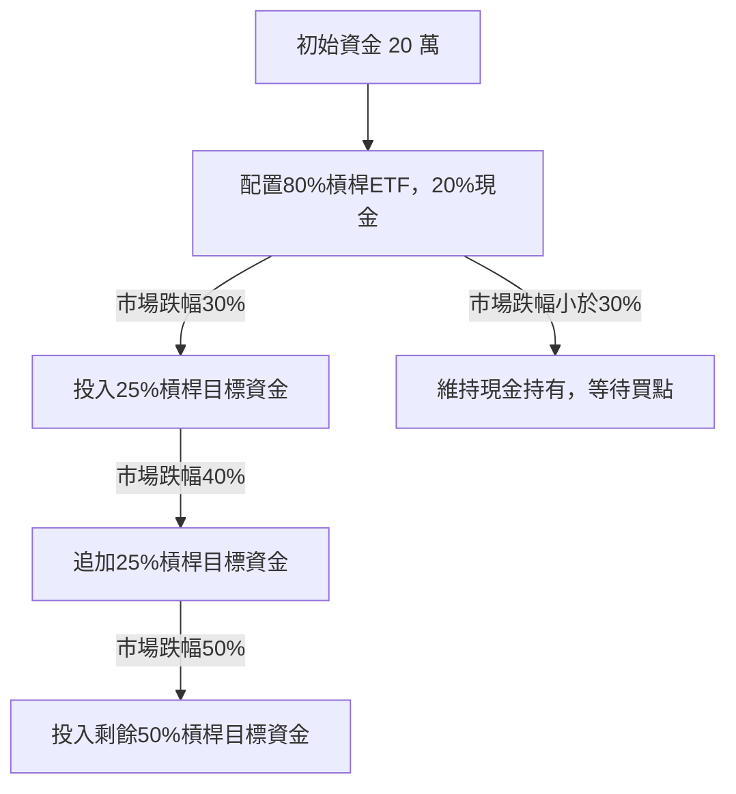
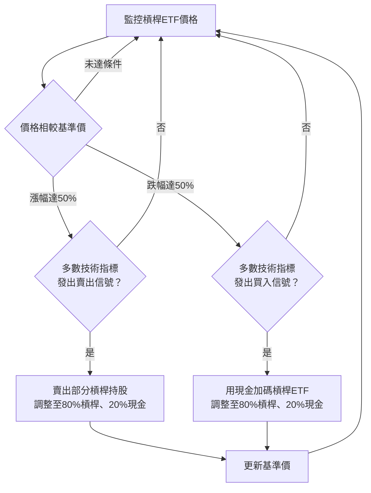
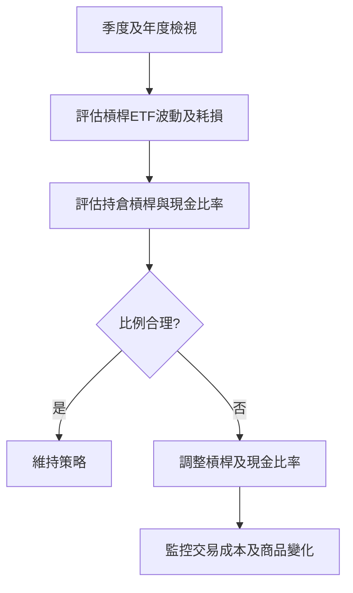
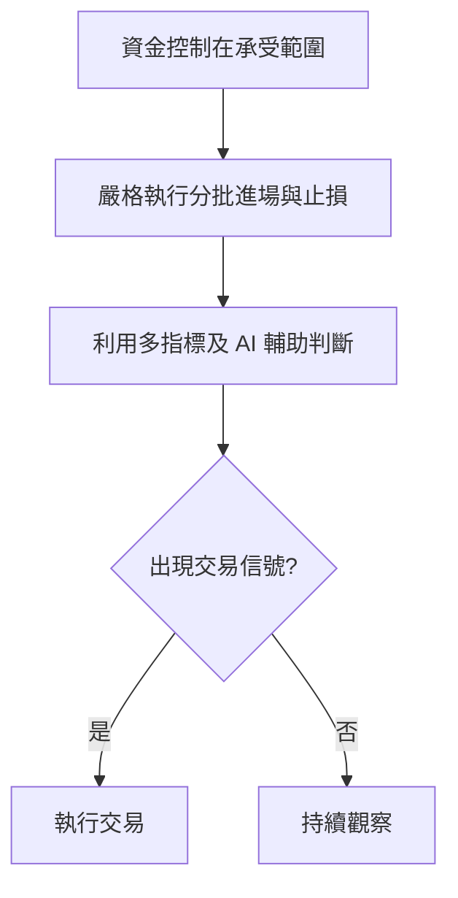

# 正2ETF槓桿投資完整計畫報告書

---

## 1. 投資目標與策略定位

- 利用正2槓桿ETF放大台灣50指數短期報酬，爭取較大資產增長空間。  
- 控管波動高風險，透過**分批佈局與再平衡策略降低損耗**。  
- 強化資金管理，設定明確**止損與獲利點**，配合年度調整提升紀律。  

---

## 2. 資金分配與分批進場策略

- 初始資金20萬元，建議投入約**80%（16萬元）**於正2槓桿ETF，其他20%留為現金或低風險資產作為加碼準備及風險緩衝。  
- 進場採分批方式：  
   - 市場跌幅達30%時，投入約25%目標資金（4萬元）。  
   - 跌幅達40%時，追加25%目標資金（4萬元）。  
   - 跌幅達50%時，投入剩餘50%目標資金（8萬元）。  
- **市場未出現大幅回調前，保持部分現金持有，耐心等待買點。**

---

## 3. 持倉再平衡策略（含技術指標輔助判斷）

核心策略為**50%漲跌幅再平衡**，結合**RSI、MACD及KD三大技術指標**輔助判斷，提升再平衡決策精準度與成功率。

### 3.1 買入條件

- 槓桿ETF價格相較基準價**下跌達50%**。  
- 同時多數技術指標發出買入訊號，包括：  
   - RSI 由低於30的超賣區回升突破30。  
   - MACD 快線（DIF）向上突破慢線（MACD線），柱狀圖轉正。  
   - KD 指標中 K 線上穿 D 線且位於20以下低檔，形成黃金交叉。

### 3.2 賣出條件

- 槓桿ETF價格相較基準價**上漲達50%**。  
- 同時多數技術指標發出賣出訊號，包括：  
   - RSI 進入70以上超買區並開始回落。  
   - MACD 快線下穿慢線（死叉），柱狀圖轉負。  
   - KD 指標中 K 線下穿 D 線且位於80以上高檔，形成死亡交叉。

### 3.3 再平衡操作   

- 價格達標且多數技術指標確認信號時，執行再平衡操作：  
  - 漲幅達50%時，賣出部分槓桿持股並回補現金，調整比例回80%槓桿、20%現金。  
  - 跌幅達50%時，利用現金部位加碼槓桿ETF，使資產配置回歸目標比例。  
- 每次再平衡後，更新基準價格，進入下一輪監控周期。  
- 此機制有效避免槓桿佔比因價格大幅波動而嚴重偏離目標比例，提升資金結構穩健與績效穩定性。 

---

## 4. 年度及季度檢視與調整

- 每季度及年度檢視持倉績效與風險狀況。  
- 檢查槓桿ETF淨值回檔幅度與累積波動耗損情況。  
- 評估持倉比例合理性，根據市場狀況調整槓桿與現金比例。  
- 年度評估若指數虧損嚴重，反思並調整策略，降低槓桿比重或暫停投入。  
- 監控交易成本與商品結構變化，適時優化持有標的。  

---

## 5. 心理建設與紀律維持

- 資金控制在可承受範圍，避免情緒化交易。  
- 堅持分批進場、止損、獲利與多技術指標策略，**避免盲目追高或恐慌賣出**。  
- 運用技術指標與 AI 輔助工具，提高操作決策的成功率。  

---

**總結**  
透過本計畫的「50%漲跌幅再平衡策略」結合多指標技術判斷，可有效控制槓桿風險，增強資金配置穩定性，並提升投資成功率。
