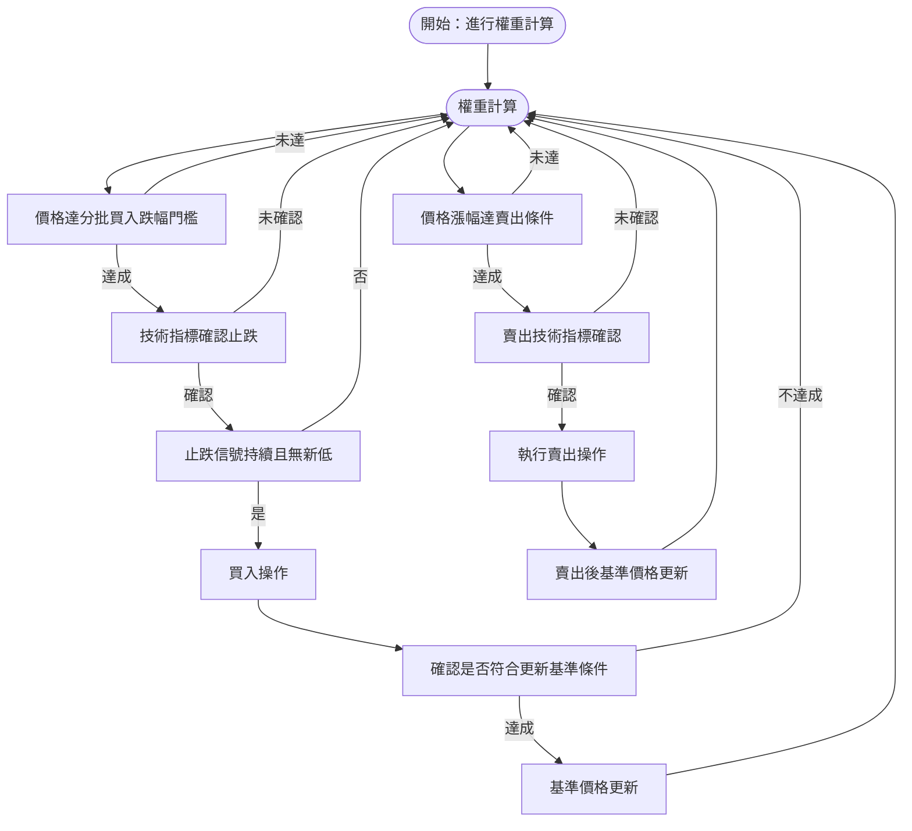

# 正2ETF槓桿投資完整計畫報告書

---

## 1. 投資目標與策略定位

- 利用正2槓桿ETF放大台灣50指數短期報酬，爭取較大資產增長空間。  
- 控管波動高風險，透過 **分批佈局與再平衡策略** 降低損耗。  
- 強化資金管理，設定明確 **止損與獲利點**，配合年度調整提升紀律。  

---

## 2. 資金分配與分批進場策略

- 初始資金：20萬元  
  - 建議投入 **80%（16萬元）** 於正2槓桿ETF  
  - 保留 **20%（4萬元）** 為現金／低風險資產，作為加碼準備與風險緩衝  

- 進場採 **分批方式**：  
  - 跌幅達 **30%** → 投入 25%（4萬元）  
  - 跌幅達 **40%** → 再投入 25%（4萬元）  
  - 跌幅達 **50%** → 投入剩餘 50%（8萬元）  

- **市場未出現大幅回調前，保持現金耐心等待買點。**

---

## 3. 持倉再平衡策略（含技術指標輔助）

**核心概念：50% 漲跌幅再平衡**  
結合 **RSI、MACD 及 KD** 三大技術指標，提升進出判斷精準度。

### 3.1 買入條件

#### 技術指標與下跌幅度權重表

| 判斷條件                          | 權重 |
|-----------------------------------|------|
| 下跌 20%                          | 1    |
| 下跌 30%                          | 3    |
| 下跌 40%                          | 4    |
| 下跌 50%                          | 5    |
| RSI 低於30後回升突破 30            | 2    |
| MACD 快線向上突破慢線              | 2    |
| KD 指標 K 線上穿 D 線，且低於20    | 2    |

#### 權重說明
- 下跌幅度依大小給予遞增權重，反映回檔買入信號強度。  
- 三大技術指標均以 2 分設定，確保 **多重共振才執行進場**。  

#### 總分與槓桿、現金配置對照表

| 權重總分區間 | 槓桿比例 | 現金比例 | 投資風格說明            |
|--------------|----------|----------|-------------------------|
| 7 ～ 8       | 80%      | 20%      | 一般保守型，常見市場狀況 |
| 9 ～ 10      | 90%      | 10%      | 積極型，反彈信心較高     |
| 11           | 95%      | 5%       | 最積極型，多重強烈訊號   |

#### 使用流程

1. 依條件累計權重分數  
2. 依分數 → 對應不同槓桿／現金配置  
3. 分數未達 7 分 → 暫停買入，持有現金  
4. 執行後更新基準價，作為下一輪判斷依據  

---

### 3.2 賣出條件

- 槓桿ETF價格相較基準價 **上漲達 50%**  
- 同時滿足 **2/3 技術指標賣出訊號**：  
  - RSI → 高於 70 並回落  
  - MACD → 快線下穿慢線，柱狀圖轉負  
  - KD → K 線下穿 D 線，且位於 80 高檔  

- 賣出後 → 持倉恢復 **槓桿 80% / 現金 20%**  
- 更新基準價  

---

## 3.3 基準價格更新規則

為確保分批佈局策略的完整性與資金效率，更新基準價格應分別遵守買入與賣出時的規則：

### 買入時更新規則

1. **更新時機限制**  
   - 最近一次交易（買入或賣出）已完成，避免頻繁操作。  
   - 價格達分批買入門檻（30%、40%、50%跌幅）之一。  
   - 技術指標出現明確止跌信號，包括：  
     - RSI 由低位回升突破30  
     - MACD 快線向上突破慢線  
     - KD 指標 K 線上穿 D 線且位於20以下  
   - 在跌幅門檻附近，市場需連續3個交易日以上維持買入技術指標，且無創新低。

2. **更新價格設定**  
   - 以最近觸發買入信號的最低價或止跌確認當日收盤價作基準價，優先選擇較保守價格。

3. **避免過早更新**  
   - 僅在確認止跌且技術指標持續買入訊號時更新基準價格，避免因初步跌幅信號過早更新，保留40%、50%買入空間。

### 賣出時更新規則

1. **賣出條件觸發時**  
   - 槓桿ETF價格相較基準價上漲達50%，且多數技術指標（RSI、MACD、KD）發出賣出訊號。  
   - 執行賣出後，**立即更新基準價格為賣出當日成交價格（收盤價或成交價）**。

2. **基準價格重置目的**  
   - 反映最新市場水平，供下一輪買賣決策做基準。  
   - 避免過時基準影響新操作判斷。

3. **避免賣出後過早買入基準更新**  
   - 賣出後基準價格更新與買入基準更新獨立判斷，防止短期波動造成策略干擾。

---

## 4. 年度與季度檢視

- 每季與年度檢視績效與風險  
- 核對 ETF 淨值回檔幅度與耗損情況  
- 評估槓桿比例合理性，視市場調整槓桿／現金  
- 指數若年度大幅虧損 → 降低槓桿或暫停投入  
- 隨時檢查交易成本與商品結構，必要時調整持有標的  

---

## 5. 心理建設與紀律維持

- 資金控制在 **可承受範圍內**，避免情緒化操作  
- 嚴守分批、止損、獲利及多指標共振原則  
- **避免追高或恐慌賣出**  
- 善用技術分析與 AI 工具提高成功率  

---

## 總結

「**50%漲跌幅再平衡策略** + **三大技術指標共振**」  
能有效控管槓桿風險、提升資金配置穩定性，並增加投資成功率。  
